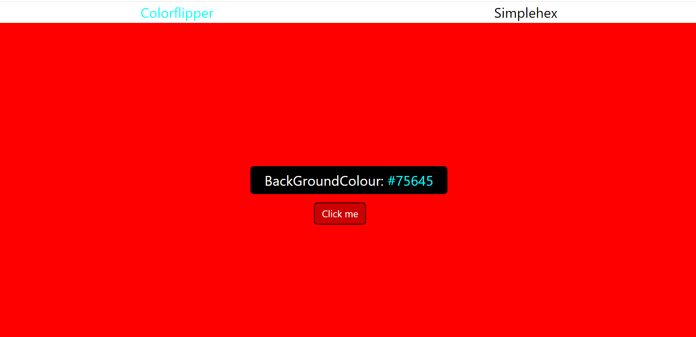

# Basic Color flipping web
## Color flipping, built with Html, tailwindcss and vanilla javascript
**My main aim for building this site is to showcase and pratice my tailwind framework knowledge, which i was able to achieve successfully.

# Stacks used includes

 * Tailwindcss
 * Vanilla js
 * HTML
 * cli 
 *  Tailwind installation using npm and npx

